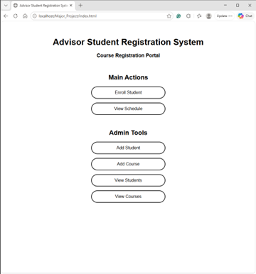

<h1>Academic Advisor Registration System</h1>

<h2>Description</h2>
Created a web-based student registration system designed for academic advisors. It allows users to manage student records, create and view courses, enroll students in courses, and view student schedules. The system is built using PHP, HTML, and CSS, with a MySQL database powered by XAMPP.
<h2>Languages and Utilities Used</h2>

- <b>PHP</b>
- <b>HTML</b>
- <b>CSS</b>
- <b>MySQL</b>
- <b>XAMPP</b>

